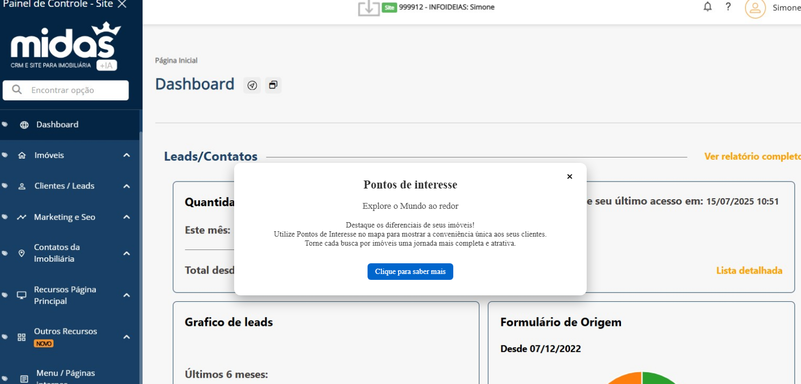
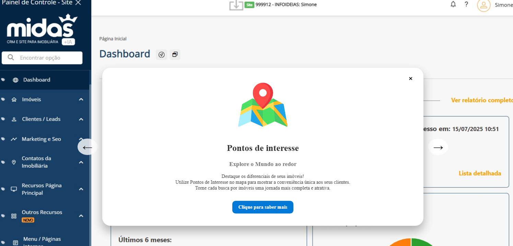
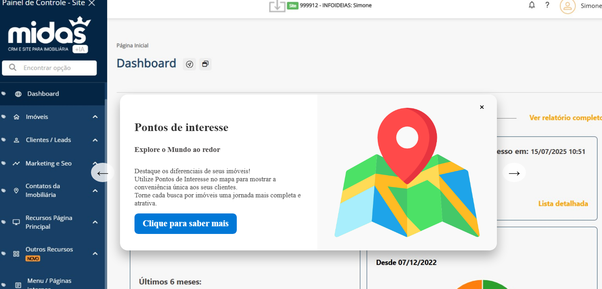
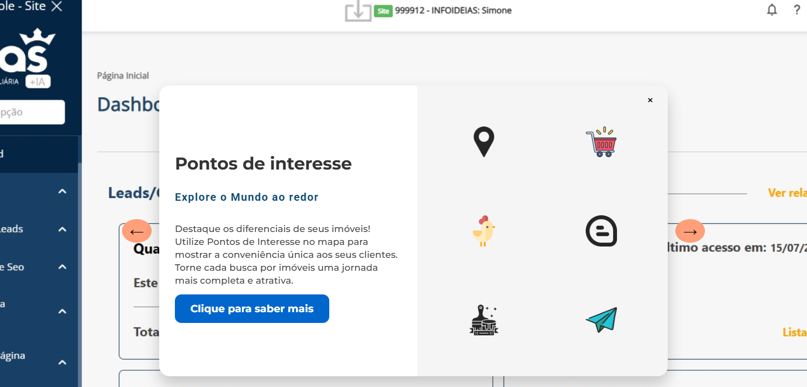
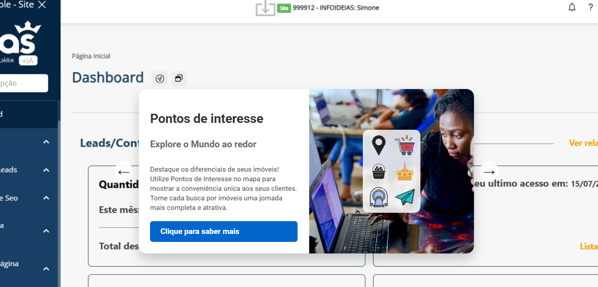
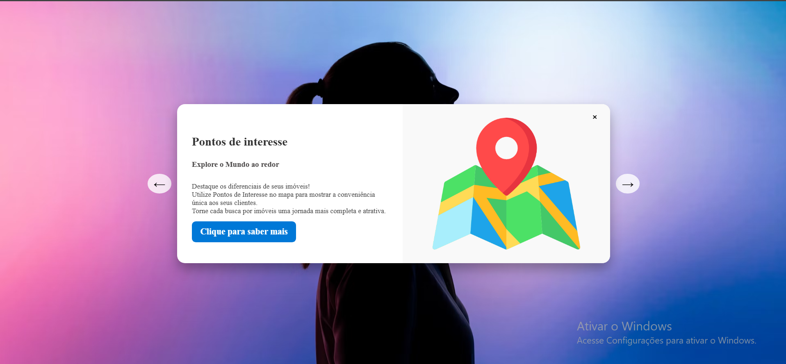

# 🧪 Teste Prático – Web Designer Júnior | Midas Mais

Este repositório contém a entrega do teste prático para a vaga de Web Designer Júnior

## 🖼️ Imagens entregues

**Exemplos de progresso**:

- Primeiro rascunho de popup

- segundo rascunho de popup

- Terceiro rascunho de popup

- Quarto rascunho de popup

- Quinto rascunho de popup

- Sexto rascunho de popup

---

## 🎨 Decisões de Design

- O Design original está bom, porém achei alguns pontos de melhoria como as cores das fontes e tamanhos que dificultam um pouco a leitura, além de algumas cores não ser tão agradável a primeira vista.

## Justificativas de redesenhar

- Achei o redesenho com o visual um pouco mais amigável a primeira vista, além de melhorar um pouco a leitura a visualização e as cores, mas vale ressaltar que ainda precisa de melhorias.

---

## Desafio 02 (Simulação landing Page)

- Simulação 02 Landing page

- Simulação 02 Landing page

## 🛠️ Ferramentas de captura

- Gimp